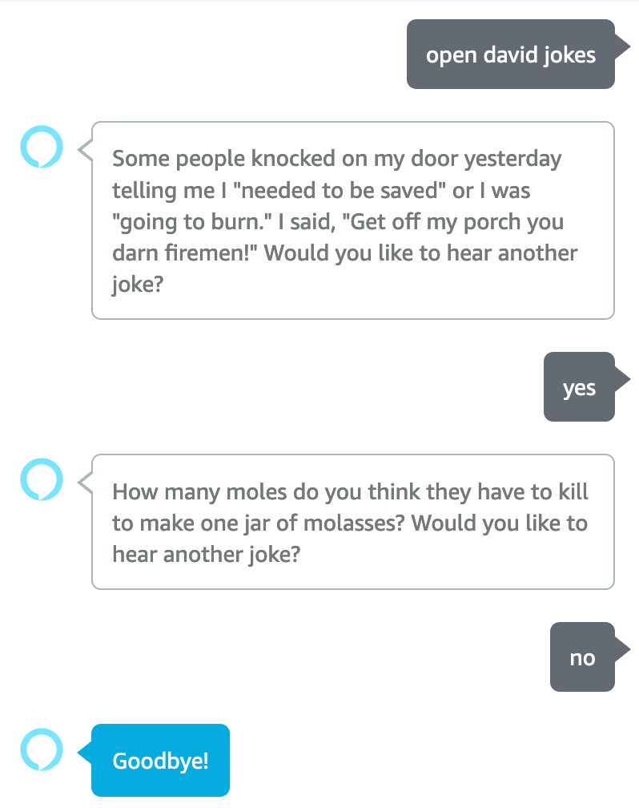

# David Jokes Alexa Skill

This skill forces Alexa to tell some of the worst David jokes.



## Local Setup

Currently, this project is hosted by Amazon. Commit to master to deploy for testing. The project is also [mirrored to GitHub](https://github.com/davidbowland/jokes-skill).

### Debugging

Local debugging is provided by [ask-sdk-local-debug](https://github.com/alexa/alexa-skills-kit-sdk-for-nodejs/tree/2.0.x/ask-sdk-local-debug). See the [ask-sdk-local-debug Github page](https://github.com/alexa/alexa-skills-kit-sdk-for-nodejs/tree/2.0.x/ask-sdk-local-debug) for more information.

## Deploy skill

This skill is automatically deployed when merged to master.

### Manual deployments

This skill can be manually deployed with:

```bash
ask deploy
```

## Additional Resources

* [ASK CLI](https://developer.amazon.com/en-US/docs/alexa/smapi/quick-start-alexa-skills-kit-command-line-interface.html)
